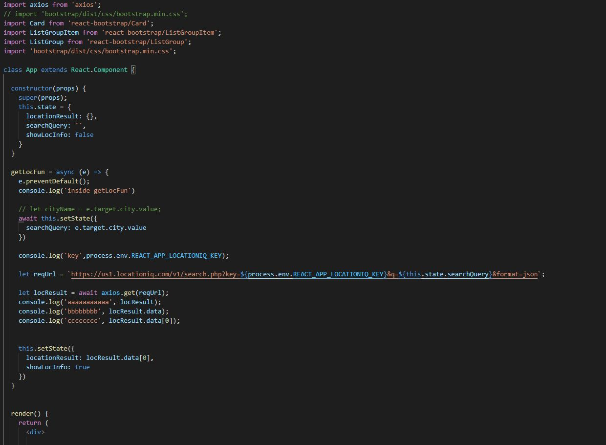
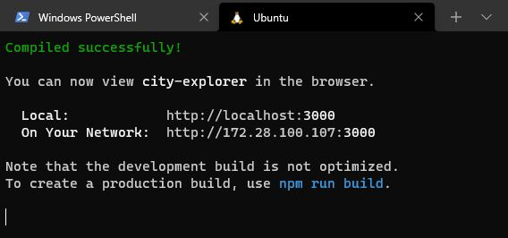
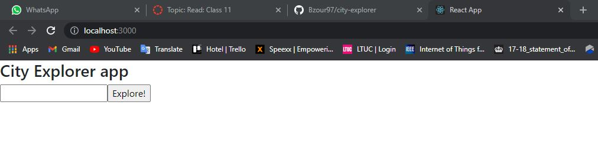
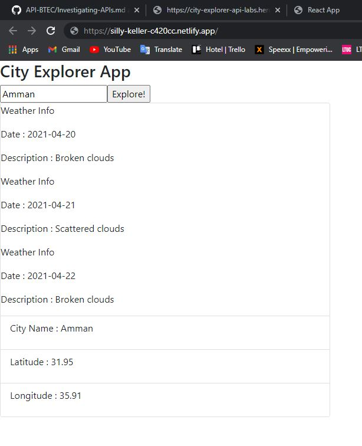

# READ-3-BTEC : Testing

## White box testing:

The white box test, it evaluates internal code and software architecture to test specified inputs for expected and desired outcomes. White box testing is focused on an application's internal functioning and focuses on internal structure testing. The design of test cases involves this kind of testing programming skills.

We should test the tools and approaches so that I have begun to examine the libraries used, whether I can import these libraries in my code import, they are also installed correctly.

Here, I made sure, both internally and mentally, if this form would prevail according to what was required. What is required is to enter the name of the city as a text, and the search entry must be “submit”.

Here I made sure that the ListGroup was efficient according to what was required, and I also looked to make sure that all the items inside it were written and arranged correctly so that they would appear to the user later as required.

### Moreover, I make sure no logical or syntax problems are encountered. In the testing and capturing error that I have used to the debugger after and while creating the code, I would also want to mention the in-code debugging tool.

## Black box testing:

Testing the black box requires testing a system without previous insight into its internal function. A testing device offers an input and monitors the system output under test. This allows the system to determine how it responds to expected and unexpected user activities, reaction time, usability problems and problems with dependability.

Initially when I finished building this program pictured above. I activate the " npm start " command for this damn program that intends to freak me out and drive me crazy. It appeared in the Ubuntu Terminal, the image below is telling me that it is working.

After that, I went to my browser to see the results of running the program, and does it return the results according to the requirements? When I opened the browser, the start page appeared to me as required, my dear, see the image below.

Then I filled out the form with the name of a city and I chose “Oman” to see if it would return me information about it according to what was required or not, and indeed this is what happened. Look at the picture below to see with your beautiful eyes, my dear teacher.

In the end, I would like to tell you that I encountered a lot of problems during my work. It happened to me that the program came out with wrong information, and this turned out to me when I performed the black box test. I also encountered several technical problems during my procedure, but I overcame them with determination, determination and challenge. .

So, you wonderful teacher, whoever you are, my dear, make me successful because I worked hard and suffered a lot from back and neck pain, and thank you.