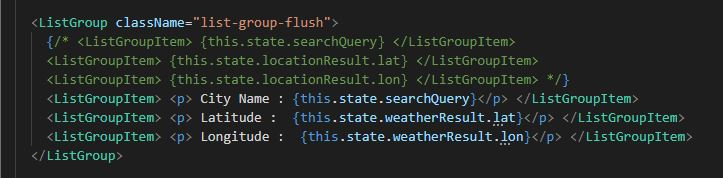

## White box testing:

The white box test, it evaluates internal code and software architecture to test specified inputs for expected and desired outcomes. White box testing is focused on an application's internal functioning and focuses on internal structure testing. The design of test cases involves this kind of testing programming skills.

We should test the tools and approaches so that I have begun to examine the libraries used, whether I can import these libraries in my code import, they are also installed correctly.

Here, I made sure, both internally and mentally, if this form would prevail according to what was required. What is required is to enter the name of the city as a text, and the search entry must be “submit”.

Here I made sure that the ListGroup was efficient according to what was required, and I also looked to make sure that all the items inside it were written and arranged correctly so that they would appear to the user later as required.

Moreover, I make sure no logical or syntax problems are encountered. In the testing and capturing error that I have used to the debugger after and while creating the code, I would also want to mention the in-code debugging tool.